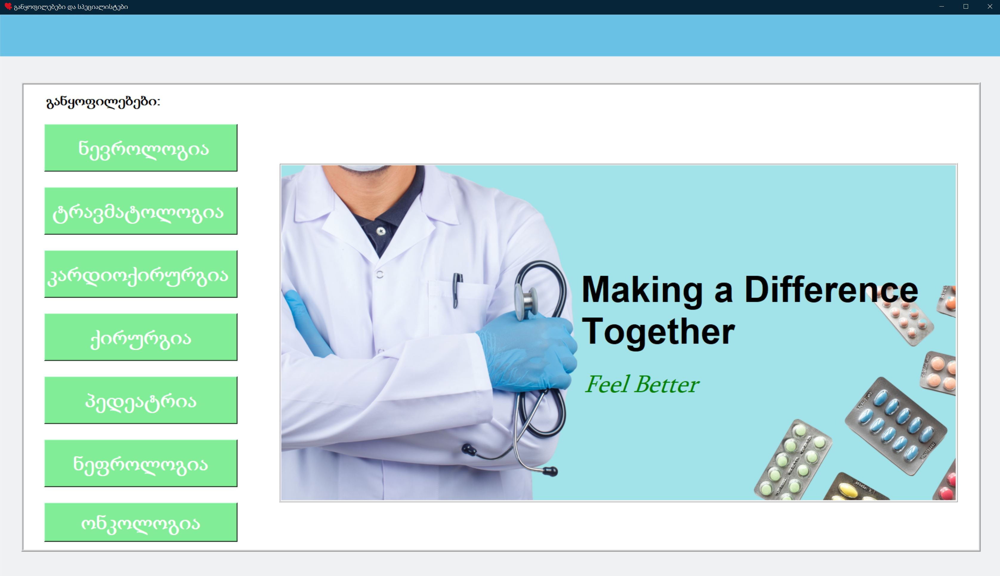
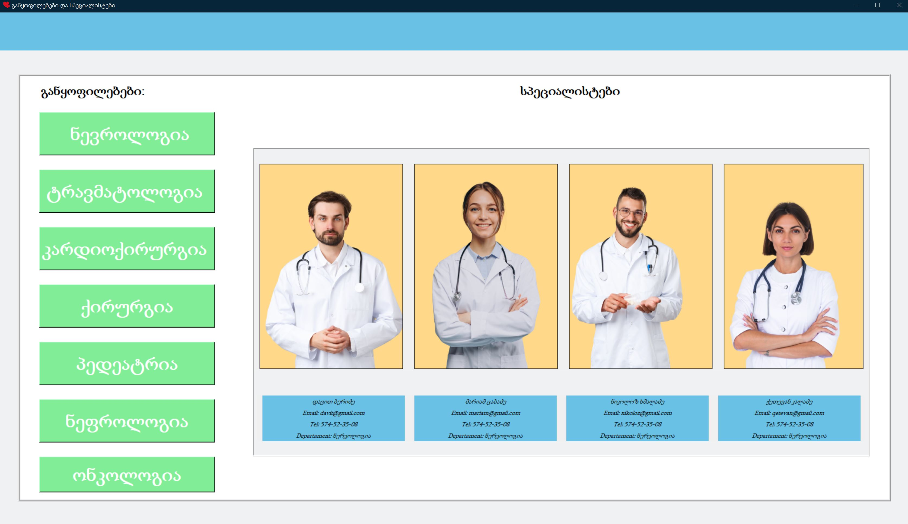

# Hospital-Databas-Tkinter
## საავადმყოფოს მონაცემთა ბაზa / Hospital database

## უნივერსიტეტში მოცემული დავალება / The task given in the university

### ამოცანის მოთხოვნა:
+ ამოცანა მოითხოვდა საავადმყოფოს მონაცემთა ბაზების მაკეტის
შექმნას და მის ვიზუალორ რეალიზაციას Tkinter-ის გამოყენებით. 
უნდა შექმნილიყო 7 განყოფილება და თითოეულ განყოფილებას
უნდა ჰყოლოდა თავისი სპეციალისტი ექიმები თავიანთი პირადი
ინფორმაციით როგორიცაა: სახელი და გვარი , ელ-ფოსტა
,ტელეფონის ნომერი.

+ The task required a mock-up of hospital databases
creation and its visual realization using Tkinter.
7 departments should be created and each department
must have its own specialist doctors with their personal
information such as: name and surname, e-mail
,telephone number.

### შედეგი:
+ შევქმენი მონაცემთა ბაზა sqlite3-ის გამოყენებით ასევე tkinter -ის
გამოყენეფით ინტერფეისი .პროგრამაში მოცემულია შვიდივე
განყოფილება თავისი ექიმებით და მათი ინფორმაციით, ასევე
უკეთესი ვიზუალური ეფექტისთვის დამატებულია ექიმის
ინფორმაციასთან ერთად მათი სურათები Canvas ვიჯეტის
გამოყენებით .

+ I created a database using sqlite3 and also i used tkinter
for interface.The program provides all seven
Department with its doctors and their information as well,
for a better visual effect i added images by using Canvas widget.

